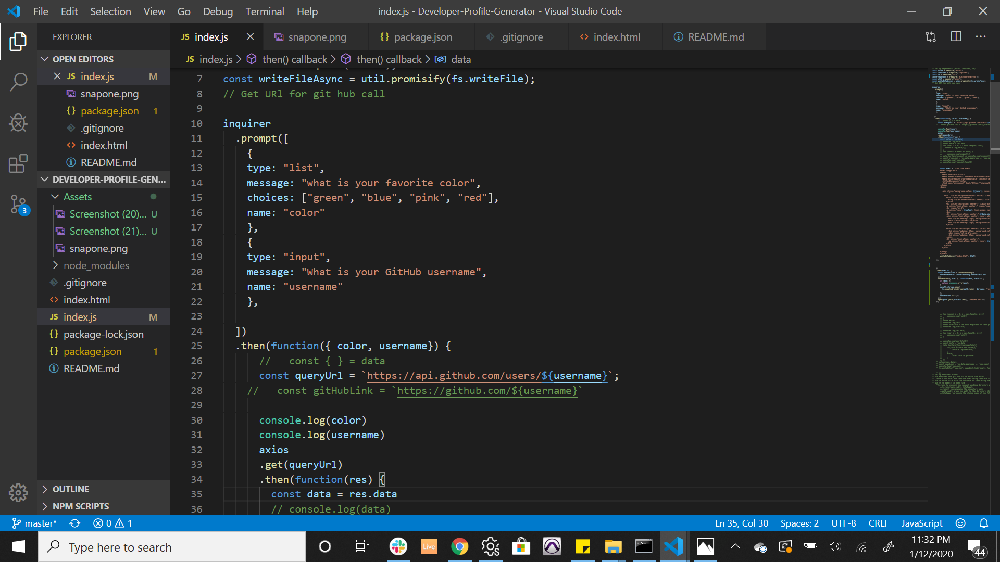
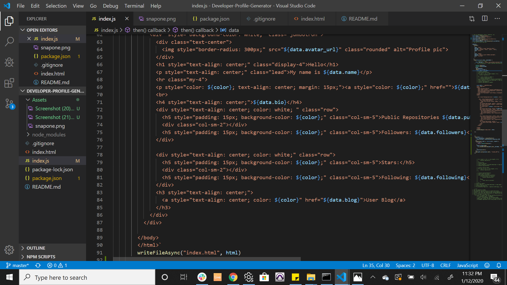

# Developer-Profile-Generator
As the product manager, I am required to meet with stakeholders every now and then, not just to give updates about projects, but also to give neccessary updates about members of the development team.

I wrote this program in order to be able to easily type in members' github username name and instantly have a pdf format of important information generated.

    I used the "inquirer" npm package to prompt user to enter favorite color and github user name. I passed the github user name to the github API call using the "axios" npm package. I used the result from the API call to append importent information to the page and also used the color input to personalize the page based on whatever color the user chooses.

    Changing the html file to a pdf format is still work in progress.

## This is the end product assuming user chooses color green:

## Some code snippet:

## Built with
* VScode

## Usage
* To be able to easily generate up-to-date information about members of the development team in pdf format.

## Contact
* Segun Alesinloye 
* segunalesh@gmail.com 
* Github repo link: https://github.com/Aleshsparrow

## Acknowledgement
* Bootstrap
* Github API
* Axios npm package
* Inquirer npm package
* Fs npm package
* Dotenv npm package
* Electron npm package
